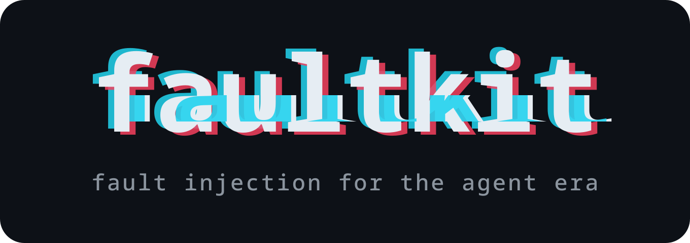

<div align="center">



### Run the error handlers you've never run.

**Fault injection for the agent era. One binary. Zero dependencies.**

[](LICENSE)
[](https://faultkit.dev)

[Install](#install) · [60-second demo](#60-second-demo) · [Scenarios](#scenarios) · [How it works](#how-it-works) · [Docs](https://faultkit.dev/#docs)

</div>

> **Status:** v0.1 — five scenarios end-to-end. See [roadmap](#roadmap) for what ships next.
> **Platforms:** macOS and Linux for HTTP scenarios. Linux 5.8+ (x86-64) for syscall-level scenarios.

---

## Your agent's error handling has never run

Your agent chains LLM calls, tool subprocesses, RAG lookups, HTTP requests. One flaky link anywhere in that chain silently corrupts the entire reasoning loop — and you find out in production.

The retry logic for a `429` from OpenAI mid-chain. The cleanup when a tool subprocess gets `SIGPIPE`'d. The fallback when your vector DB returns shuffled results. **You wrote that code. You've never seen it run.**

faultkit deterministically triggers the failures your agents hit in production, so you can fix them before your users do.

---

## 60-second demo

The failure mode: your agent retries an OpenAI call after a `429`, but the retry uses partial reasoning state and produces a confidently wrong answer. You won't catch this in a unit test. You'll catch it in faultkit.

```bash
# Install (macOS / Linux)
curl -sSL https://faultkit.dev/install | sh

# Run your tests with 20% of OpenAI calls returning 429
faultkit run --scenario llm-api-degraded -- pytest tests/agent/
```

That's it. No mocks. No fixtures. Your agent code calls `api.openai.com` exactly the way it does in production — and faultkit returns a real HTTP 429 with a real `Retry-After` header, indistinguishable from the real thing.

```text
=== faultkit summary ===
scenario:    llm-api-degraded
target:      pytest tests/agent/
duration:    14.2s
faults fired: 7 (target: ~20% of 34 requests to api.openai.com)
target exit:  1 (FAIL)

  tests/agent/test_planning.py::test_recovers_from_rate_limit  FAILED
  tests/agent/test_research.py::test_handles_partial_context   FAILED

run with --verbose to see each fault as it fires
```

Two failing tests you didn't have yesterday. Two production bugs you won't have tomorrow.

---

## Scenarios

faultkit ships scenarios mapped to real production failure modes. Each one targets a layer in the agent stack where errors actually originate.

### LLM and gateway

| Scenario | What it does | v0.1 |
|---|---|:---:|
| `llm-api-degraded` | Inject 429 / 503 / timeout into requests to OpenAI, Anthropic, Bedrock, Vertex, etc. | ✅ |
| `malformed-json-response` | LLM returns 200 OK with syntactically invalid JSON in the body | ✅ |
| `llm-streaming-cutoff` | Drop the SSE connection mid-stream after N tokens | ✅ |
| `context-window-squeeze` | Silently truncate large prompts at the SDK boundary | 🛣️ |
| `gateway-timeout` | LiteLLM / Portkey / custom gateway returns slow or hangs | 🛣️ |

### RAG and vector DB

| Scenario | What it does | v0.1 |
|---|---|:---:|
| `rag-corruption` | Pinecone / Weaviate / Qdrant returns stale or shuffled results | 🛣️ |
| `embeddings-degraded` | Embeddings endpoint returns 5xx intermittently | 🛣️ |

### Tool calls and subprocesses

| Scenario | What it does | v0.1 |
|---|---|:---:|
| `tool-permission-denied` | `EACCES` / `EPERM` on the agent's file or path access | ✅ |
| `tool-call-flaky` | Subprocess gets `SIGPIPE`, OOM-killed, or returns truncated stdout | 🛣️ |
| `tool-slow` | Subprocess hangs for N seconds, exposes timeout-handling bugs | 🛣️ |

### Backend classics

| Scenario | What it does | v0.1 |
|---|---|:---:|
| `flaky-network` | Probabilistic `ECONNRESET` and latency spikes (Linux, syscall-level) | ✅ |
| `disk-full` | `ENOSPC` on write after N bytes | 🛣️ |
| `slow-dns` | 500–5000ms delay on resolution, intermittent `EAI_AGAIN` | 🛣️ |
| `fd-exhaustion` | `EMFILE` after N open descriptors | 🛣️ |

✅ = working in v0.1 today · 🛣️ = on the v0.2 / v0.3 roadmap

All scenarios are free and open source. Forever.

---

## How it works

You don't need to know this to use faultkit. But if you're going to run it in your CI, you'll want to.

faultkit picks the right injection mechanism for each scenario automatically. Three are supported:

**HTTPS proxy.** For LLM / RAG / gateway scenarios. faultkit runs an in-process MITM proxy, terminates TLS with a CA it provisions for the target process only, and rewrites HTTP responses (status codes, bodies, streaming). The target sees a real HTTP 429 from a real TLS connection, because that's what it gets. Connections are served over HTTP/1.1 (HTTP/2 isn't proxied yet), which is transparent to virtually every HTTP client. Cross-platform, no privileges required.

This relies on the target trusting faultkit's per-run CA (it does — faultkit points the standard CA-bundle environment variables at it). The one thing it can't intercept is **certificate pinning**: a client that pins a specific certificate or public key, rather than trusting the system/injected CA bundle, will reject the proxy's leaf and the scenario won't fire. The mainstream LLM SDKs (OpenAI, Anthropic, and the like) don't pin, so this mostly affects hardened mobile or bespoke clients.

**Base-URL mode (`--base-url`).** Some clients ignore `HTTPS_PROXY` entirely — Node's global `fetch`/undici, and SDKs running inside a subprocess whose environment is filtered. For those, `faultkit run --base-url` points the SDK at faultkit directly by injecting the provider's base-URL variable (`OPENAI_BASE_URL`, `ANTHROPIC_BASE_URL`, …) instead of a proxy setting. The SDK connects to faultkit as if it were the API; faultkit synthesizes the fault or forwards to the real upstream. No proxy env to honor, no CA trust to arrange — which is what makes it work for the SDK-based clients that dominate agent code.

Either way, if *no* request actually reaches faultkit (the client ignored the proxy, or never used the base URL), the run warns loudly rather than passing silently — a green run that injected nothing is more dangerous than a red one.

**eBPF, Linux 5.8+.** For syscall-level scenarios — backend chaos, tool-call subprocess failures, file permission denials. faultkit attaches small eBPF programs to the relevant syscall kprobes (`recvmsg`, `recvfrom`, `openat`) and uses `bpf_override_return` to rewrite syscall return values for processes inside the target's PID tree. The target sees a real `ECONNRESET`, a real `EACCES`, because that's what the kernel returned.

**LD_PRELOAD shim, v0.2.** For the gap in between — dynamically linked targets where you want syscall-level fidelity without root, or you're on macOS (where `DYLD_INSERT_LIBRARIES` plays the same role). The shim is a small C library that interposes on libc functions and forwards faults from the runner via shared memory.

Auto-mode is the default. Linux + caps available + scenario fits → eBPF. HTTP scenario → proxy. macOS → proxy and (in v0.2) shim. You can always force a mode with `--mode=ebpf` / `--mode=proxy` / `--mode=shim`, and add `--base-url` to make proxy mode inject base-URL env instead of `HTTPS_PROXY`.

Why three mechanisms instead of one: the failures your agent hits in production *don't all live at the same layer*. An LLM 429 lives in HTTP semantics on top of TLS. A `SIGPIPE` on a tool subprocess lives at the pipe stdio layer. An `ENOSPC` lives at the filesystem syscall layer. A single-mechanism tool can fake the others, but the faked version exercises different code paths than the real one. faultkit gives you the real one.

---

## Authoring scenarios

Write a YAML file. faultkit handles the rest.

```yaml
# nightmare.yaml
name: nightmare
description: Multiple failures happening simultaneously.

experiments:
  - name: "OpenAI rate-limited mid-reasoning"
    fault:
      http_status: 429
      response_headers:
        Retry-After: "30"
    match:
      host: api.openai.com
    probability: 0.2

  - name: "Network drops on backend recv"
    fault:
      errno: ECONNRESET
    match:
      syscall: recvmsg
    probability: 0.05

  - name: "Tool can't read its config"
    fault:
      errno: EACCES
    match:
      syscall: openat
    probability: 0.05
```

Run it:

```bash
faultkit run --config nightmare.yaml -- go test ./...
```

Schema reference: [docs.faultkit.dev/scenarios](https://faultkit.dev/docs/scenarios).

---

## Scenario registry

faultkit ships an in-repo scenario registry at
[`scenarios/`](scenarios/). Point the binary at it with
`--registry-root ./scenarios` (or set `FAULTKIT_REGISTRY_ROOT`).

```bash
faultkit run \
  --registry-root ./scenarios \
  --scenario llm/llm-api-degraded \
  -- pytest tests/agent/
```

The binary never fetches over the network. CI runs
`faultkit validate` on every YAML and regenerates
`scenarios/INDEX.md` automatically. To add a scenario: drop a YAML
in the right pack, regenerate the catalog, open a PR. See
[docs/registry.md](docs/registry.md) for the model, the resolution
rules, and the `faultkit validate` subcommand.

---

## Install

**Quick install**

```bash
# macOS, Linux
curl -sSL https://faultkit.dev/install | sh
```

**From a release**

```bash
# Resolve the latest version, then download + extract for your platform.
# Platforms: linux_amd64 · linux_arm64 · darwin_amd64 · darwin_arm64
VERSION=$(curl -fsSL https://api.github.com/repos/faultkit/faultkit/releases/latest \
  | grep -m1 '"tag_name"' | cut -d'"' -f4)
curl -fsSL "https://github.com/faultkit/faultkit/releases/download/$VERSION/faultkit_${VERSION#v}_linux_amd64.tar.gz" \
  | tar -xz faultkit
sudo mv faultkit /usr/local/bin/faultkit
```

**Package managers**

```bash
brew install faultkit/tap/faultkit   # macOS / Linux (Homebrew)
yay -S faultkit-bin                   # Arch (AUR)
go install github.com/faultkit/faultkit/cmd/faultkit@latest
```

**Requirements**

- **Proxy-mode scenarios**: any platform with a working Go runtime. No privileges.
- **eBPF-mode scenarios**: Linux 5.8+ on x86-64, with BTF and
  `CONFIG_BPF_KPROBE_OVERRIDE` enabled. (The BPF programs hook `__x64_sys_*`
  kprobes and use `bpf_override_return`, which needs that kernel config —
  most distro kernels have it, some minimal/cloud kernels don't. arm64
  isn't supported yet.) The simplest path is `sudo`:

  ```
  sudo faultkit run --scenario flaky-network -- ./your-target
  ```

  The file-capabilities path also works and avoids running the target
  as root. faultkit needs three capabilities:

  ```
  sudo setcap 'cap_bpf,cap_net_admin,cap_perfmon=+ep' /usr/local/bin/faultkit
  ```

  - `cap_bpf` + `cap_net_admin` — load BPF programs and attach the kprobes.
  - `cap_perfmon` — kernel requires it for tracing-class BPF programs (kprobes, tracepoints).

  No `cap_sys_ptrace` is needed: at load time faultkit briefly raises its
  own `dumpable` flag via `prctl(PR_SET_DUMPABLE, 1)` so cilium/ebpf can
  read `/proc/self/mem` for kernel/BTF detection, then restores it. The
  trade-off is a short window during load where another process running as
  your user could ptrace-attach to faultkit. faultkit is a developer tool —
  that's acceptable on a developer machine or single-tenant CI runner. If
  it's not, use `sudo` instead.

**Process-tree propagation works through wrappers.** faultkit registers
the PID it forks; descendants inherit the registration automatically,
so `sh -c '... curl ...'` and similar wrappers fire faults on the
inner process the same as a direct invocation.

**Heads-up on Go targets**: Go's `net/http` reads via `read()` rather
than `recvmsg()`/`recvfrom()`. faultkit's kprobes only cover the
latter two, so libc-based clients (most C/Python/Node tooling) get
faulted but Go HTTP targets don't. Use the proxy scenarios for Go
targets.

Run `faultkit check` after install — it tells you which modes are available on your machine and why.

---

## CI integration

Drop it into your test command. Distinct exit codes let CI branch on the outcome:

| Code | Meaning |
|---|---|
| `0` | Target passed under fault |
| `1` | Target failed (the fault found a bug — usually what you want to see in CI) |
| `2` | Internal faultkit error |
| `3` | Fault never fired (your test didn't exercise the code path) |
| `4` | Usage error |

GitHub Actions example:

```yaml
- name: Resilience tests
  run: faultkit run --scenario llm-api-degraded -- pytest tests/agent/
```

More CI recipes: [examples/](./examples/).

---

## Roadmap

**Shipped (v0.1)**

- HTTPS proxy injector with `llm-api-degraded`, `malformed-json-response`, `llm-streaming-cutoff`
- eBPF injector with `flaky-network`, `tool-permission-denied`
- YAML scenario loading
- Auto-mode selection, `faultkit check`, distinct exit codes
- GitHub Actions integration

**Next (v0.2)**

- LD_PRELOAD / DYLD shim mode
- More tool-call scenarios (`tool-call-flaky`, `tool-slow`)
- RAG / embeddings scenarios (`rag-corruption`, `embeddings-degraded`)
- More backend scenarios (`disk-full`, `slow-dns`, `fd-exhaustion`)

**Later (v0.3+)**

- Coverage reporting — which syscalls / endpoints did your service actually hit?
- Scenario packs for specific stacks (LangChain, LlamaIndex, AWS SDK)
- Observability correlation (Datadog, Sentry, Grafana, Honeycomb)
- Exploratory: uprobe-based TLS interception for environments where a proxy isn't viable

---

## faultkit Pro

The OSS core is free for individuals and open-source projects, forever. **Pro** is for teams standardizing resilience testing across an organization. It's not built yet — features ship after the v0.1 community proves the wedge. The likely shape:

- Scenario packs for specific stacks and agent frameworks
- Regression tracking across CI builds
- Blast-radius controls for staging / production
- Observability correlation
- Team dashboards
- Compliance evidence (SOC 2 CC7.2, ISO 27001 A.17, DORA Article 25)

Interested? [Get on the list →](https://faultkit.dev/pro)

---

## Contributing

Contributions welcome. The project uses an Apache-style individual CLA — the bot will walk you through it on your first PR (~30 seconds, one-time).

- Write a scenario → [scenarios guide](https://faultkit.dev/docs/scenarios)
- Report a bug → [open an issue](https://github.com/faultkit/faultkit/issues/new)
- Ask a question → [Discussions](https://github.com/faultkit/faultkit/discussions)

Good first issues are tagged on the [issue tracker](https://github.com/faultkit/faultkit/issues?q=label%3A%22good+first+issue%22).

---

## License

Apache 2.0. Free for individuals, teams, and open-source projects, always.

---

<div align="center">

### Stop guessing if your agent is resilient.

### Run the dark code.

**[faultkit.dev](https://faultkit.dev)**

</div>
